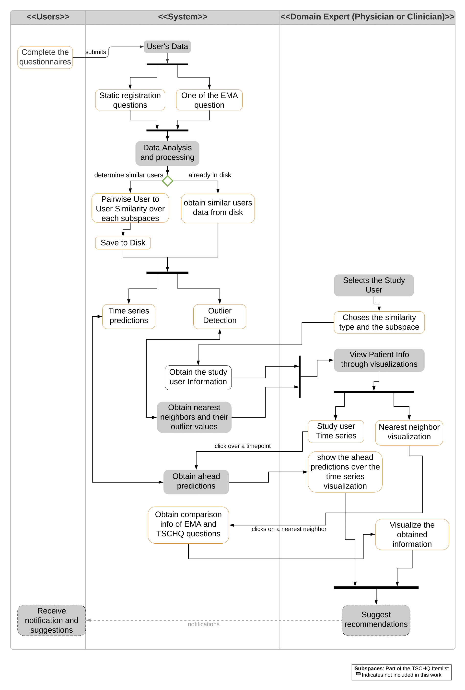
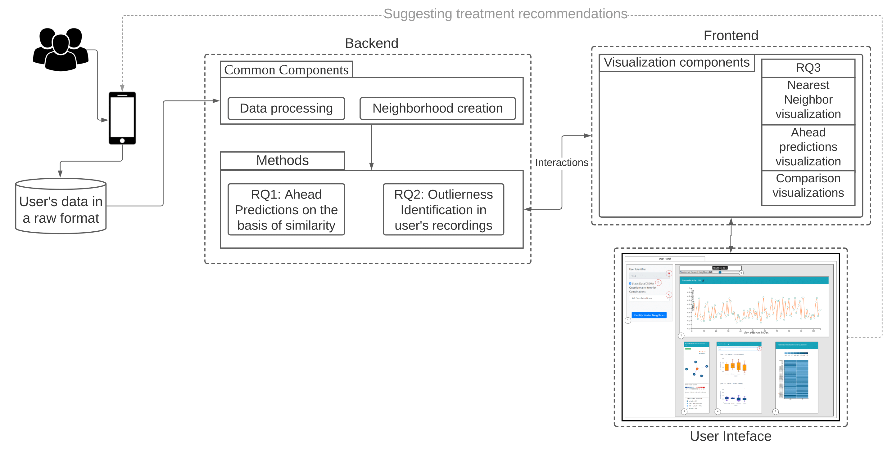
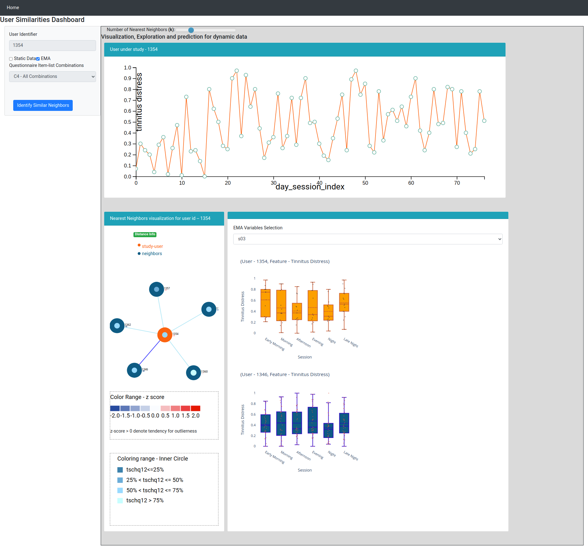

# Interactive System for Similarity-Based Inspection and Assessment of the Well-Being of mHealth Users

## Assessed Research Questions Ideas:  
1. Is it possible to assess the future tinnitus distress predictions of the mHealth application users just by looking at their similar evolving neighbors?  
  a. For this RQ, various similarity measures where implemented and using feature subspaces neighbors of dealing with different medical conditions where obtained and their tinnitus distress within the day were utilize to make ahead predictions for a user under study.
2. Identification of outliers within the neighborhood.  
  a. For this RQ, a new voting approach combining the ideas of ranking based outlier detection, and Local Outlier Factor and ensemble of detection is created and votes are provided.  
3. Understanding various similarity differences of the users who evolve together by proposing a medical analytics tool to understand difference of the mHealth users.  
  a. For this purpose, a medical analytics tool is proposed using a new approach to visualize nearest neighbors, ability to perform predictions within the tool, and also better understanding the difference amongst the mHealth users. This tool and the results of such an interactive system to explore the usefulness of neighborhoods and the outlierness of an individual can help bring scientists in two fields come closer together. The medical practitioner can use such a system to better intuit factors that make users different, which researchers in computer science can use to develop better algorithms to discover these differences and visualize them in a way that non-experts can intuitively understand.  
 
## Workflow of the introduced methodologies:  

## Workflow of the medical analytics tool:  

## Screenshot of the developed dashboard:  
<kbd>

</kbd>

## Used technologies:  
1. For machine learning algorithm analysis - python, pandas, sklearn, numpy, scipy.
2. For backend component development - flask, json, pymongo
3. For visualization component - plotly, d3.js, jquery, html, javascript

